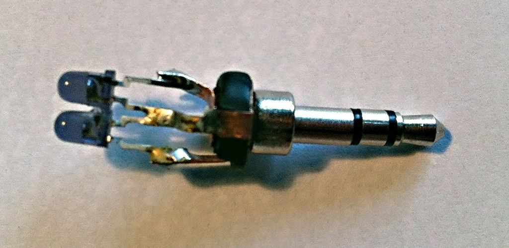
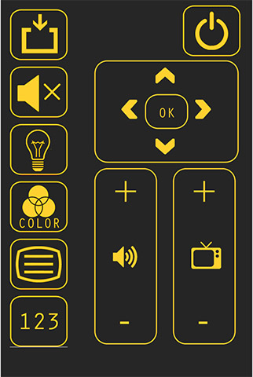

# Philips RC6 Remote Control via Audio Jack

Stuff to **control your TV** with a **DIY infrared dongle** from any device with a headphone jack.

Or in clickbait: *You won't believe that you can control your TV from your phone for under $5 (with this simple trick)*

⚠️ **Note** This is a *very* old project I rediscovered on my harddrive and decided to put on github as this could be of general interest. The code is in a very bad shape and does not use appropriate or modern technologies, neither does it follow any best practices. This was just a short, simple hack.

## Introduction

### Hardware

Remote controls use a fairly simple protocol. The transmission happens with an infrared LED that either trasmits a fixed carrier frequency or is switched of. The pattern of carrier frequency and off state determines the code that is sent to the TV.

This project uses a self built IR dongle that consists of

* A headphone plug
* Two 940nm infrared LEDs soldered between the two channels and ground


*The DIY dongle consists of 3 components soldered together*

This project controls a Phillips (some old model) TV, which uses a protocol called RC6. RC6 has sine-wave carrier frequency of `36KHz`. The maximum sample rate most devices can play is `44100Hz`. Now, by the Nyquist theorem, we would need at least `72K` samples per second, to transmit the carrier frequency. 

The solution to this problem is to use both audio channels and play a `18KHz` frequency with one pi phase-shift on either channel. This way, when looking at both LEDs, it appears as it was a `36KHz` signal.

### Codes

Phillips RC6 is Manchester coded. We write the manchester code-pairs as two normal bits:

* Positive edge: logical 1  --> write as 01
* Negative edge: logical 0  --> write as 10

Then the code for RC6 is quite easy

```
[Leader bits]  [Mode] [Trailer]  [CRTL]   [INF]  [IDLE]
   1111110010  010101      0011    CTRL     INF  000000
```

Where as `CTRL` and `INF` are the manchester codings (`1` -> `01`, `0` -> `10`) of the `CTRL` and thr `INF` byte. The `CTRL` byte defines the TV model, the `INF` byte the command that is sent. There is no checksum. The leader bits seem to remain constant. I never observed a mode different than all zero. The odd-shaped trailer part marks the end of the header.

A tool in this repository takes strings in this format and produces `.wav` files that reproduce the command as audio (to be played by the IR dongle).

### Remote control app

There is a small website that acts as a frontend for the remote. One can open that up on a phone to turn it into a remote control. The directory also contains the sound files I generated for the old Phillips TV. 




## Getting started

### Compile & run the tool

Make sure you have **libsndfile** installed. On OSX:

```
brew install libsndfile
```


```
g++ -o ir_wave_tool -lsndfile main.cpp
./ir_wave_tool
```

The tool will ask you for the code, enter it as a fully expanded manachester code, including the header and everything. (Just as written above).


### Start the app

The application is just a static HTML and the sound files. Host them wherever you'd like :)

# License

MIT License

Copyright (c) 2012 Thomas Debrunner

Permission is hereby granted, free of charge, to any person obtaining a copy
of this software and associated documentation files (the "Software"), to deal
in the Software without restriction, including without limitation the rights
to use, copy, modify, merge, publish, distribute, sublicense, and/or sell
copies of the Software, and to permit persons to whom the Software is
furnished to do so, subject to the following conditions:

The above copyright notice and this permission notice shall be included in all
copies or substantial portions of the Software.

THE SOFTWARE IS PROVIDED "AS IS", WITHOUT WARRANTY OF ANY KIND, EXPRESS OR
IMPLIED, INCLUDING BUT NOT LIMITED TO THE WARRANTIES OF MERCHANTABILITY,
FITNESS FOR A PARTICULAR PURPOSE AND NONINFRINGEMENT. IN NO EVENT SHALL THE
AUTHORS OR COPYRIGHT HOLDERS BE LIABLE FOR ANY CLAIM, DAMAGES OR OTHER
LIABILITY, WHETHER IN AN ACTION OF CONTRACT, TORT OR OTHERWISE, ARISING FROM,
OUT OF OR IN CONNECTION WITH THE SOFTWARE OR THE USE OR OTHER DEALINGS IN THE
SOFTWARE.

